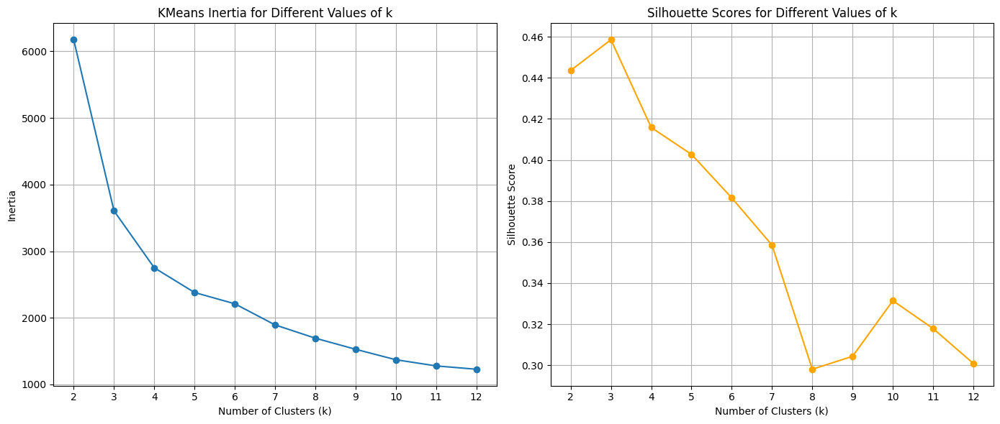
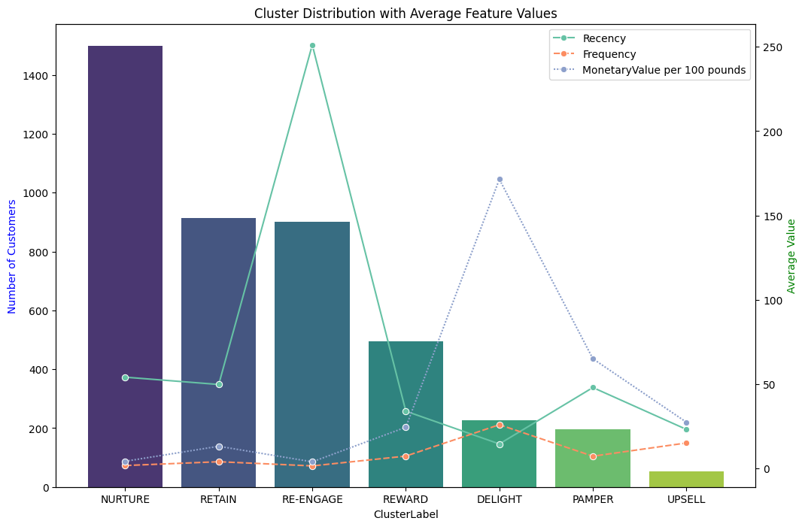

# 🛍️ Customer Segmentation — RFM Analysis & KMeans Clustering

> Turning **525,461 raw retail transactions** into **7 named customer segments**, each with a specific marketing action — so a business can stop sending the same message to everyone.

An end-to-end data science case study: messy e-commerce export → cleaned RFM features → KMeans clustering → seven actionable customer groups → business recommendations. Built in **Python (pandas, scikit-learn)**.

📖 **[Read the full case study →](https://saimmi.github.io/Customer-segmentation-analysis-/)**

---

## 📌 The brief

Most companies market to every customer the same way — the loyal monthly buyer, the one-time visitor from a year ago, and the wholesale client spending thousands a month all get the same email. This project replaces that with a behaviour-based segmentation system that answers:

- Who are our most valuable customers?
- Who is about to churn?
- Who deserves loyalty rewards, and who needs onboarding?
- Where should marketing spend its next pound?

> **Scope note:** Dataset sourced from the **UCI Online Retail II** repository — a real UK-based online gift retailer, December 2009–December 2010. Findings describe *this retailer's* customer base for that period, not e-commerce in general. The "marketing team" framing is a portfolio device.

---

## 🛠 The pipeline

| Stage | Tool | What happens |
|---|---|---|
| **1. Explore** | pandas | Profile the raw export; find returns, admin rows, missing IDs, junk stock codes |
| **2. Clean** | pandas | Keep only valid orders & products; drop null customers and zero-price rows |
| **3. Feature-engineer** | pandas | Collapse 406K transactions into one **RFM** row per customer |
| **4. Handle outliers** | pandas | Split extreme customers out (IQR) so they don't distort the clusters |
| **5. Scale + cluster** | scikit-learn | StandardScaler → KMeans; choose *k* with elbow + silhouette |
| **6. Label + recommend** | — | Name 7 segments and attach a marketing action to each |

```
Raw Excel → clean → RFM features → scale → KMeans (+ outlier groups) → 7 segments → recommendations
```

---

## 🧹 Data cleaning — ~23% removed, every cut documented

| What was removed | Why | Rows |
|---|---|---:|
| Invoices not matching `^\d{6}$` | Removes `C` cancellations & `A` admin write-offs (kept only real orders) | ~10,200 |
| Stock codes that aren't products | Postage, samples, manual/bank-charge entries — not real sales | ~2,450 |
| Missing `Customer ID` | Can't attribute a transaction to a customer | ~107,900 |
| Zero-price rows | Free samples / data errors | 28 |

**Result: 406,309 clean rows retained (77.3% of the original 525,461).** Cleaning was done with regex masks on the invoice and stock-code formats, so cancellations and operational rows are filtered by *structure*, not by guessing.

---

## 🔑 Key findings

**1. Revenue is brutally concentrated.** The three "elite" segments (DELIGHT, PAMPER, UPSELL) are just **11% of customers but ≈61% of all revenue**. DELIGHT alone — **5.3% of customers — drives ≈45% of revenue.** This is the textbook case *for* segmentation: a flat marketing budget badly under-serves the customers who actually pay the bills.

**2. Recency is the churn alarm.** The RE-ENGAGE segment (902 customers) averages a **single** purchase and **~251 days** since last order — long-dormant one-timers. They're 21% of customers but only 4% of revenue. Win-back, not loyalty spend.

**3. The base is mostly new-and-quiet.** NURTURE (1,499 customers, the largest group) buys rarely (≈2 orders) and recently — these are early-stage relationships to grow, not yet to reward.

**4. A clear "good regulars" core exists.** REWARD (494 customers) spends well (~£2,400) and bought recently (~34 days). Reliable, loyal, and the natural target for a VIP programme.

---

## 👥 The 7 segments (real numbers from this dataset)

| Segment | Customers | Avg £ | Avg orders | Days since last order | Read | Action |
|---|---:|---:|---:|---:|---|---|
| **DELIGHT** | 226 | £17,148 | 26 | 14 | Elite — huge spend, very frequent, very recent | Dedicated account management |
| **PAMPER** | 197 | £6,498 | 7 | 48 | Big spenders, fewer orders | Premium / concierge treatment |
| **REWARD** | 494 | £2,436 | 7 | 34 | Loyal high-value regulars | VIP loyalty programme |
| **UPSELL** | 53 | £2,735 | 15 | 23 | Very frequent, lower spend per order | Bundles & cross-sell |
| **RETAIN** | 914 | £1,309 | 4 | 50 | Solid repeat customers | Keep-warm loyalty offers |
| **NURTURE** | 1,499 | £418 | 2 | 54 | New / low-frequency, recent | Onboarding & education |
| **RE-ENGAGE** | 902 | £385 | 1 | 251 | One-time, long dormant | Win-back campaigns |

*DELIGHT, PAMPER and UPSELL are the IQR-flagged outliers, segmented separately so a handful of enterprise-scale buyers don't pull the KMeans centres off the typical customer.*

---

## 🤖 Choosing *k* — an honest note

Silhouette score actually **peaked at k = 3 (≈0.46)** and dropped to **≈0.42 at k = 4**; the elbow on inertia bends in the same 3–4 range.

I chose **k = 4** anyway — a deliberate trade of a slightly lower silhouette for **richer, more actionable segments**. At k = 3 the "good regulars" and "new-and-quiet" customers merge into one blob that you can't write distinct campaigns for. With the four KMeans clusters plus the three outlier groups, every segment maps to a *different* marketing action, which is the entire point of the exercise. Metric purity lost a little; business usefulness gained a lot.




---

## 🧰 Tech stack

`Python` · `pandas` · `scikit-learn (KMeans, StandardScaler)` · `matplotlib` · `seaborn` · `Jupyter` · `RFM Analysis` · `Unsupervised Learning` · `Customer Analytics`

---

## 📂 Repository contents

| File | What it is |
|---|---|
| [`retail-data-clustering.ipynb`](./retail-data-clustering.ipynb) | Full notebook — exploration, cleaning, RFM, clustering, labelling |
| [`index.html`](./index.html) | The written case study (served via GitHub Pages) |
| [`images/`](./images) | Saved charts — elbow/silhouette, cluster distribution, RFM heatmap |
| [`requirements.txt`](./requirements.txt) | Python dependencies |

> **Data is not committed** (the Online Retail II Excel file is large). Download it from the [UCI repository](https://archive.ics.uci.edu/dataset/502/online+retail+ii) and place it at `./data/online_retail_II.xlsx` before running the notebook.

---

## ▶️ How to run

```bash
# 1. Clone
git clone https://github.com/saimmi/Customer-segmentation-analysis-.git
cd Customer-segmentation-analysis-

# 2. (Optional) virtual environment
python -m venv venv && source venv/bin/activate   # Windows: venv\Scripts\activate

# 3. Install dependencies
pip install -r requirements.txt

# 4. Add the dataset
#    Download online_retail_II.xlsx from UCI and put it in ./data/

# 5. Run
jupyter notebook retail-data-clustering.ipynb
```

---

## 🔭 What I'd improve next

- **Add Recency to the outlier logic** — outliers are currently flagged on Monetary and Frequency only; a hyper-recent or hyper-stale customer can slip through.
- **Try DBSCAN / hierarchical clustering** to see whether the segment boundaries hold under a different algorithm.
- **Build a scoring pipeline** that assigns *new* customers to a segment automatically, and a small Streamlit/Power BI dashboard on top.
- **Layer in a churn-probability model** using Recency + Frequency as features, turning RE-ENGAGE from a static group into a ranked risk list.

---

## 🔗 Project links

- 📁 **GitHub repo:** https://github.com/saimmi/Customer-segmentation-analysis-
- 📝 **Case study (blog):** https://saimmi.github.io/Customer-segmentation-analysis-/
- 💼 **LinkedIn:** https://www.linkedin.com/in/s-nisha-31a78b212/
- 🍴 **Related project — Pan-India Restaurant Market Intelligence (Swiggy):** https://github.com/saimmi/swiggy-market-intelligence

---

## 📚 Dataset citation

Chen, D. (2015). *Online Retail II* [Dataset]. UCI Machine Learning Repository. https://doi.org/10.24432/C5CG6D

<sub>All segment figures computed directly from the cleaned data (4,285 customers). Author: S. Nisha.</sub>
